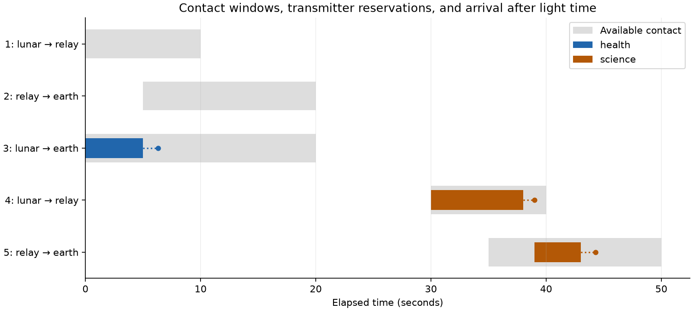

# contact-router

space links run on a schedule. say a relay is reachable from 2:00 to 2:20, the downlink opens at 3:10, two contacts share one transmitter, and every bundle expires. there is no "path right now" to route over, only a calendar.

contact-router finds the earliest arrival for each bundle across that calendar and books the radio time, so two routes never hold the same transmitter.

contact-router is a small C++20 planner for a network whose links appear only during scheduled contact windows. it routes a whole bundle across those windows and reserves transmission time on each link. in a spacecraft network, aggregate link capacity is insufficient when the bundle, contact window, or shared radio is unavailable at the required time.

a route is a sequence of stored bundles, waits, transmissions, and propagation delays. the planner models all four explicitly.

```text
bundle released
      |
      v
stored at node
      |
      v
first free contact slot
      |
      v
shared radio calendar
      |
      v
arrival after delay
```



## routing a contact plan

each contact has a sender, receiver, opening and closing time, byte rate, propagation delay, and optional shared resource. contacts with the same resource use one reservation calendar. two contacts can therefore be individually open while still being unable to transmit together because they share one radio.

the search labels each reached node with its earliest known arrival time. from that time, it scans every outgoing contact for the first calendar gap that can hold the whole transmission. it then adds propagation delay and continues from the receiving node. arrival exactly at the bundle expiry is allowed; completing a transmission exactly at a contact closing time is also allowed.

earlier arrival at a node dominates a later one under this model. storage is unlimited, waiting is free, and a bundle can wait for the next contact. each resource calendar is scanned in time order and uses the first gap that fits, so arriving earlier cannot remove an option that arriving later would create. buffer limits, energy cost, congestion pricing, or a different service discipline can invalidate this one-label search.

the implementation uses integer microseconds throughout. transmission duration is `ceil(bytes * 1,000,000 / rate)` without floating-point rounding. it divides into whole seconds and a remainder before multiplying, which avoids overflowing on large bundle sizes. every addition that could exceed the signed time range is checked. a contact that would overflow, miss its window, or arrive after expiry is not a candidate.

the search has a configurable contact-examination budget. when it reaches that budget, it returns `search_limit`. a budget stop and a completed search with no feasible route have distinct results. contacts are sorted by ID before search, and an equal-arrival label never replaces the existing one. together with the CLI's bundle order, that makes ties deterministic even if the input rows arrive in a different order.

## reserve only a complete route

searching does not mutate a calendar. after a complete path is found, the router copies the calendars and route registry, adds every hop booking, sorts each calendar, records the route, and swaps the copies into place. a failed search, a deadline miss, or a search-budget stop consumes no capacity. an allocation failure during a later hop also leaves the prior plan untouched.

[`Router::release`](include/contact/router.hpp) removes a planned route's bookings, and a contact cannot be disabled while a reservation still uses it. release removes planning state only; it cannot undo a transmission that already happened.

copying the full calendars costs work proportional to existing bookings on every successful reservation. for large plans, updating only the affected intervals would avoid copying the full state.

## example and batch scheduling

in the included lunar example, health data has higher priority and takes the direct contact. it arrives at 6.3 seconds and holds the lunar transmitter from 0 to 5 seconds. the science bundle cannot fit in the remaining part of the first relay contact, so it waits for the later contact, crosses the relay, and arrives at 44.3 seconds. the image bundles have no feasible route after those bookings.

the CLI orders a batch by release time, descending priority, earliest expiry, then bundle ID. for each bundle it finds the earliest-arrival route given reservations already made. this greedy policy does not optimize the whole batch for throughput, fairness, or total lateness. a per-bundle optimum can block a later bundle whose alternative would have been cheaper. global batch scheduling needs a different objective and joint optimization.

## build and run

requires C++20 and CMake 3.20+. it has no runtime dependencies.

```sh
cmake -S . -B build -DCMAKE_BUILD_TYPE=Release
cmake --build build --parallel 3
ctest --test-dir build --output-on-failure
./build/contact-route examples/contacts.csv examples/bundles.csv
./build/contact-route examples/contacts.csv examples/bundles.csv --bookings
```

the CSV files use integer microseconds, bytes, and bytes per second. the first command prints one result per bundle; `--bookings` prints the reserved transmitter intervals. names accept letters, digits, underscores, hyphens, and dots. quoted CSV fields are deliberately unsupported.

the included example produces this route summary:

```text
health,reserved,6300000,6300000,3
science,reserved,44300000,44300000,4;5
image,no_route,,,
expired-image,no_route,,,
```

## verification and boundaries

[the test executable](tests/test_router.cpp) compares 2,800 reservations with an independent exhaustive simple-path search and a microsecond-by-microsecond slot scan. it also exercises waiting, shared-transmitter conflicts, expiry and propagation boundaries, release and contact outages, integer overflow, search limits, and deterministic input permutations. `ctest` runs this as one test target.

there is no fragmentation, receiver-conflict model, buffer limit, retransmission, uncertain contact time, or full half-duplex radio model. a shared resource is one transmitter calendar. it is a planning simulator, not a Bundle Protocol implementation.

the API is [router.hpp](include/contact/router.hpp); the search and commit code are in [router.cpp](src/router.cpp). reproduce the reservation plot with Matplotlib and `python examples/plot.py`. enable sanitizers with `-DCONTACT_SANITIZERS=ON -DCMAKE_BUILD_TYPE=Debug`. NASA's [delay/disruption tolerant networking overview](https://www.nasa.gov/communicating-with-missions/delay-disruption-tolerant-networking/) gives the broader store-and-forward context.
